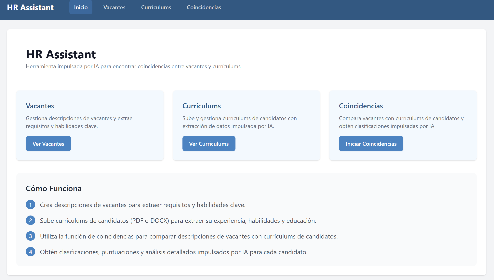
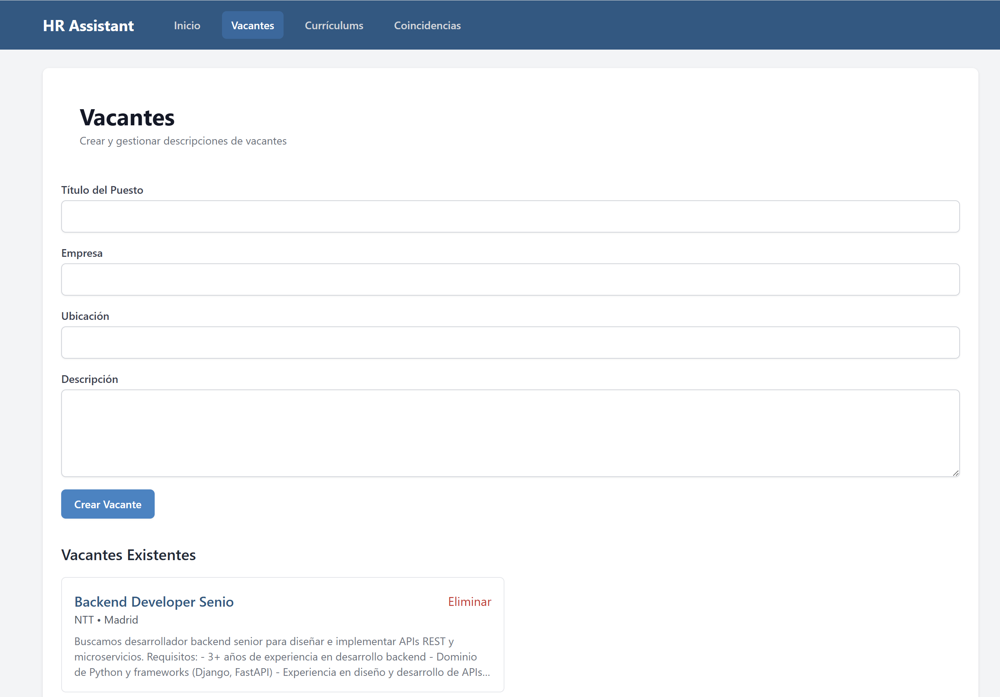
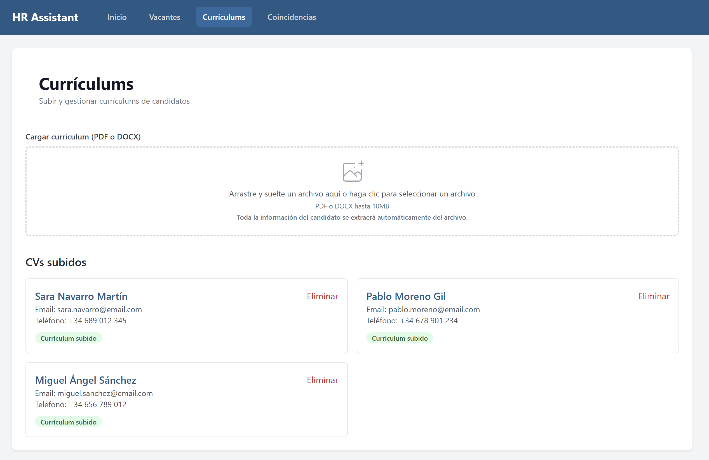
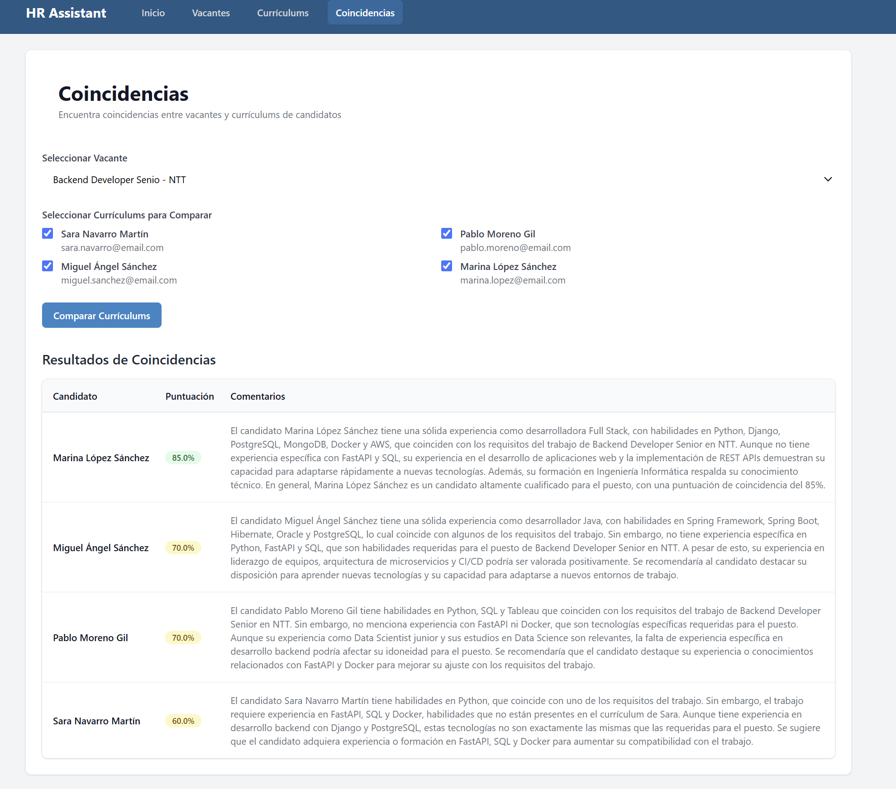

# HR-Assistant-AI

Sistema inteligente de reclutamiento que utiliza inteligencia artificial para analizar currículums y encontrar los mejores candidatos para cada puesto de trabajo.

## 📋 Descripción

HR-Assistant-AI es una aplicación web completa diseñada para optimizar el proceso de reclutamiento mediante el uso de inteligencia artificial. El sistema permite a los reclutadores gestionar descripciones de puestos de trabajo, procesar currículums de candidatos y realizar coincidencias automáticas entre ambos para identificar a los candidatos más adecuados para cada posición.

## 📸 Capturas de Pantalla

### Página de Inicio


### Gestión de Vacantes


### Gestión de Currículums


### Coincidencias entre Vacantes y Currículums


## ✨ Características Principales

- **Gestión de Vacantes**: Crea y gestiona descripciones de puestos de trabajo con extracción automática de requisitos y habilidades clave.
- **Procesamiento de Currículums**: Sube y analiza currículums en formato PDF o DOCX con extracción automática de datos mediante IA.
- **Coincidencia Inteligente**: Compara automáticamente las vacantes con los currículums para encontrar los mejores candidatos.
- **Análisis Detallado**: Obtén puntuaciones y análisis detallados para cada coincidencia entre candidato y puesto.
- **Interfaz Intuitiva**: Diseño moderno y fácil de usar con Tailwind CSS y React.

## 🛠️ Tecnologías Utilizadas

### Backend
- **FastAPI**: Framework web de alto rendimiento para APIs con Python.
- **SQLAlchemy**: ORM para interactuar con la base de datos PostgreSQL.
- **LangChain**: Framework para aplicaciones impulsadas por modelos de lenguaje.
- **OpenAI**: Integración con modelos GPT para el análisis de texto.
- **PyPDF2 y python-docx**: Bibliotecas para extraer texto de archivos PDF y DOCX.

### Frontend
- **Next.js**: Framework de React para aplicaciones web.
- **React**: Biblioteca JavaScript para construir interfaces de usuario.
- **Tailwind CSS**: Framework CSS para diseño rápido y responsivo.
- **Axios**: Cliente HTTP para realizar peticiones a la API.
- **React Dropzone**: Componente para subida de archivos con arrastrar y soltar.
- **React Hook Form**: Biblioteca para gestionar formularios en React.

### Base de Datos
- **PostgreSQL**: Sistema de gestión de bases de datos relacional.

## 🗂️ Estructura del Proyecto

```
├── backend/                # Servidor FastAPI
│   ├── app/
│   │   ├── api/            # Endpoints de la API
│   │   ├── core/           # Configuración central
│   │   ├── db/             # Configuración de la base de datos
│   │   ├── models/         # Modelos SQLAlchemy
│   │   ├── schemas/        # Esquemas Pydantic
│   │   ├── services/       # Lógica de negocio
│   │   └── utils/          # Utilidades (manejo de archivos, etc.)
│   └── requirements.txt    # Dependencias de Python
└── frontend/              # Aplicación Next.js
    ├── src/
    │   ├── components/     # Componentes React reutilizables
    │   ├── pages/          # Páginas de la aplicación
    │   ├── styles/         # Estilos CSS
    │   └── utils/          # Utilidades (API, etc.)
    ├── .env.local.example  # Ejemplo de variables de entorno
    └── package.json        # Dependencias de Node.js
```

## 📋 Requisitos Previos

- **Python 3.7+**
- **Node.js 14+**
- **PostgreSQL**
- **Cuenta de OpenAI** (para obtener una API key)

## 🚀 Instalación y Configuración

### Backend

1. Clona el repositorio:
   ```bash
   git clone https://github.com/tu-usuario/HR-Assistant-AI.git
   cd HR-Assistant-AI
   ```

2. Crea un entorno virtual de Python:
   ```bash
   python -m venv venv
   source venv/bin/activate  # En Windows: venv\Scripts\activate
   ```

3. Instala las dependencias:
   ```bash
   cd backend
   pip install -r requirements.txt
   ```

4. Configura las variables de entorno:
   - Crea un archivo `.env` en la carpeta `backend` con las siguientes variables:
     ```
     POSTGRES_SERVER=localhost
     POSTGRES_PORT=5432
     POSTGRES_USER=tu_usuario
     POSTGRES_PASSWORD=tu_contraseña
     POSTGRES_DB=resume_ranking
     OPENAI_API_KEY=tu_api_key_de_openai
     UPLOAD_FOLDER=uploads
     ```

5. Inicia el servidor:
   ```bash
   uvicorn app.main:app --reload
   ```
   El backend estará disponible en `http://localhost:8000`.

6. Inicializa la base de datos:
   - Visita `http://localhost:8000/init-db` en tu navegador para crear las tablas necesarias.

### Frontend

1. Instala las dependencias:
   ```bash
   cd frontend
   npm install
   ```

2. Configura las variables de entorno:
   - Crea un archivo `.env.local` en la carpeta `frontend` basado en `.env.local.example`:
     ```
     NEXT_PUBLIC_API_URL=http://localhost:8000/api/v1
     ```

3. Inicia el servidor de desarrollo:
   ```bash
   npm run dev
   ```
   El frontend estará disponible en `http://localhost:3000`.

## 🧑‍💻 Uso

1. **Gestión de Vacantes**:
   - Accede a la sección "Vacantes" para crear y gestionar descripciones de puestos de trabajo.
   - Completa el formulario con el título, empresa, descripción y requisitos del puesto.
   - El sistema extraerá automáticamente las habilidades y requisitos clave.

   

2. **Gestión de Currículums**:
   - Accede a la sección "Currículums" para subir y gestionar currículums de candidatos.
   - Sube archivos en formato PDF o DOCX.
   - El sistema extraerá automáticamente la información del candidato, habilidades, experiencia y educación.

   

3. **Coincidencias**:
   - Accede a la sección "Coincidencias" para comparar vacantes con currículums.
   - Selecciona una descripción de puesto y los currículums que deseas comparar.
   - El sistema generará puntuaciones y análisis detallados para cada candidato.

   

## 🔄 Flujo de Trabajo

1. Crea descripciones de vacantes para extraer requisitos y habilidades clave.
2. Sube currículums de candidatos (PDF o DOCX) para extraer su experiencia, habilidades y educación.
3. Utiliza la función de coincidencias para comparar descripciones de vacantes con currículums de candidatos.
4. Obtén clasificaciones, puntuaciones y análisis detallados impulsados por IA para cada candidato.

## 🤝 Contribución

Las contribuciones son bienvenidas. Por favor, sigue estos pasos para contribuir:

1. Haz un fork del repositorio
2. Crea una rama para tu característica (`git checkout -b feature/amazing-feature`)
3. Haz commit de tus cambios (`git commit -m 'Add some amazing feature'`)
4. Haz push a la rama (`git push origin feature/amazing-feature`)
5. Abre un Pull Request

## 📄 Licencia

Este proyecto está licenciado bajo la Licencia MIT - ver el archivo LICENSE para más detalles.

---

Desarrollado con ❤️ para optimizar los procesos de reclutamiento mediante IA.
